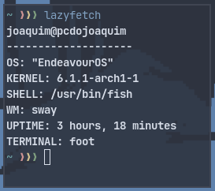

# LAZYFETCH

- Shut the fuck up - My friend
- NOOOOOOO where are the logos!!! - People on r/unixporn

A simple modular fetch for those who are lazy.



# Usage

Step 1 - Download this<br>
Step 2 - Run `lazyfetch`<br>
Step 3 - Profit<br>

# Installation

```bash
$ git clone https://gitlab.com/Jocadbz/lazyfetch.git
$ cd lazyfetch
$ v -prod . # You need V compiler
```

# Configuration

Lazyfetch is a modular fetch, which means you can easily add new functions and place them on your fetch. <br>
For the sake of speed, lazyfetch is configured directly on the source code, similar to suckless tools. <br>
<br>
Detailed instructions and how to write and configure modules are written on the [Wiki](https://github.com/Jocadbz/lazyfetch/wiki). <br>
(If you don't want to configure those, Lazyfetch is fairly usable on it's default state.) <br>

*Made in V, btw*